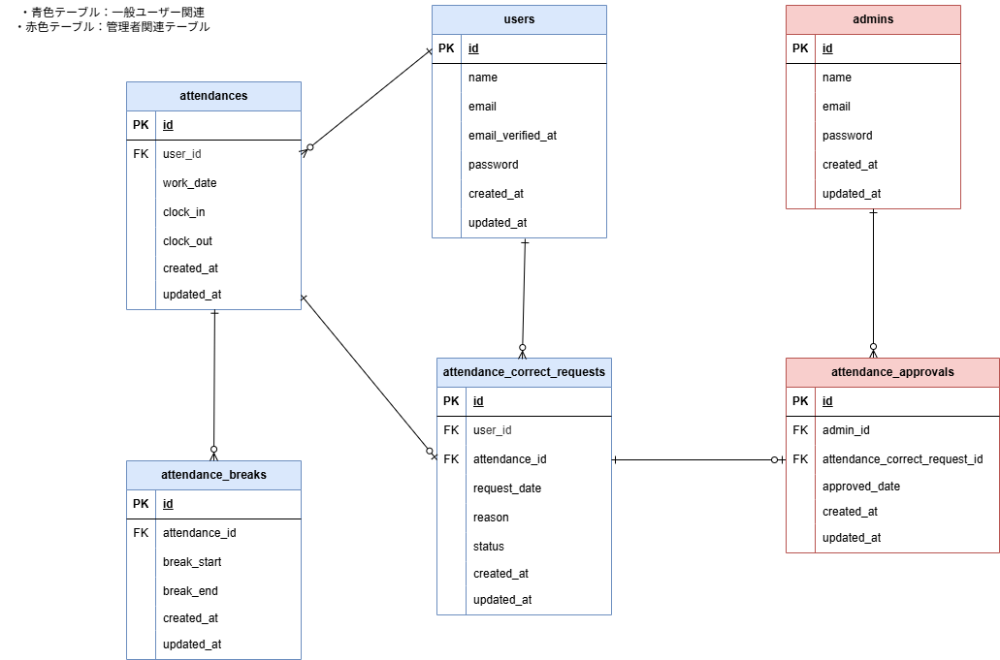

# 勤怠管理アプリ：attendance-management-app
<!-- 10/17Laravelプロジェクト立ち上げ時に簡易記述 -->

## 前提条件
- Gitがインストールされている
- GitHubが使用できる状態
    - SSH接続が設定済みであること
- Docker & Docker Composeを使用できる状態

## 環境構築

**Dockerビルド**
1. git clone git@github.com:ai2525desu/attendance-management-app.git
2. Docker Desktopを立ち上げる
3. docker compose up -d --build

**Laravel環境構築**
1. docker compose exec php bash
2. composer install
3. 「.env example」ファイルを「.env」ファイルに命名変更。または、新しく「.env」ファイルを作成する。
4. 「.env」ファイルの該当箇所に下記の環境変数を追加
    * DBに関する記述
    ```
    DB_CONNECTION=mysql
    DB_HOST=mysql
    DB_PORT=3306
    DB_DATABASE=laravel_db
    DB_USERNAME=laravel_user
    DB_PASSWORD=laravel_pass
    ```
    * テスト用メール送信設定(Mailhog)に関する記述
    ```
    MAIL_MAILER=smtp
    MAIL_HOST=mailhog
    MAIL_PORT=1025
    MAIL_USERNAME=null
    MAIL_PASSWORD=null
    MAIL_ENCRYPTION=null
    MAIL_FROM_ADDRESS=mailhog-attendance@example.com
    MAIL_FROM_NAME="${APP_NAME}"
    ```
5. アプリケーションキーの作成<br>
    ``` php artisan key:generate ```
6. src/storage/app/publicのディレクトリ下に保存してある画像を使用するために、シンボリックリンク作成<br>
    ``` php artisan storage:link ```
7. テーブルデータ反映のためにマイグレーションの実行<br>
    ``` php artisan migrate ```
8. ダミーデータ反映のためにシーディング実行<br>
    ``` php artisan db:seed ```

**使用するマイグレーションファイル一覧**
* 2014_10_12_000000_create_users_table.php
* 2025_10_28_222221_create_admins_table.php
* 2025_10_28_222237_create_attendances_table.php
* 2025_10_28_223811_create_attendance_breaks_table.php
* 2025_10_28_223842_create_attendance_correct_requests_table.php
* 2025_10_28_223906_create_attendance_approvals_table.php

**シーダーファイル**
<!-- 作成後、その都度追加すること -->
* AdminsTableseeder.php
* UsersTableseeder.php

<!-- 10/17 PHPUnitテスト実行できるように各ファイル記述済みの状態。記述内容確認必ず -->
## PHPUnit/テスト環境の準備と実行について
**テスト環境の準備**
1. 「.env.testing.example」を「.env.testing」に命名変更。または、新しく「.env.testing」ファイルを作成する。
    - Mailhogの内容は「.env」と変更なし。
    - アプリケーションキーは空の状態。
2. 「.env.testing」に対してアプリケーションキーを取得。<br>
    ``` php artisan key:generate --env=testing```<br>
※ PHPUnit 実行前に migrate や seed を手動で実行する必要はありません。
3. mysqlのコンテナ内に入る<br>
    ``` docker compose exec mysql bash ```
4. mysqlをrootユーザーで使用する。<br>
    ``` mysql -u root -p ```
5. passwordにrootを入力する。<br>
    ``` root ```
6. attendance_management_testのDBを作成する<br>
    ``` CREATE DATABASE attendance_management_test; ```

**PHPUnitの実行**
1. phpコンテナに入る<br>
    ``` docker compose exec php bash ```
2. 下記のコマンドでテストを実行する<br>
    ``` php artisan test ```

<!-- Ubuntu,VSCode,Docker最終記述で確定すること -->
## 使用環境（実行環境）
- Windows 11 Home
- Ubuntu 
- VSCode 
- Docker version 
- Laravel Framework 8.83.29
- PHP 8.1
- nginx:1.21.1
- mysql:8.0.26
- Mailhog

## 用意されているログインユーザー情報
- 下記ユーザーでログイン可能です。
1. 管理者
    - **Email**: `admin@example.com`
    - **Password**: `adminpassword`
2. 一般ユーザー
    **ユーザー名**: `山田太郎`
        - **Email**: `yamada@example.com`
        - **Password**: `password`
    **ユーザー名**: `花田洋子`
        - **Email**: `hanada@example.com`
        - **Password**: `password`

## 権限エラー対策（Windows）
* ホストとコンテナ間のファイル権限不一致によるエラーを防ぐため、docker/php/Dockerfileにて独自ユーザー('ai2525desu')を作成し、root権限以外でLaravelを実行している
    - Dockerfile一部抜粋<br>
    ```RUN useradd -m ai2525desu```
* docker-compose.ymlにてphpの箇所に下記記載を付け加えることでユーザーIDを指定している
    - 一部抜粋
        ```
        php:
            build: ./docker/php
            user: "1000:1000"
            volumes:
            - ./src:/var/www/
        ```

## ER図


## URL
* 一般ユーザーログイン画面：http://localhost/login
* 管理者ログイン画面：http://localhost/admin/login
* phpmyadmin:http://localhost:8080
* Mailhog Web UI:http://localhost:8025/